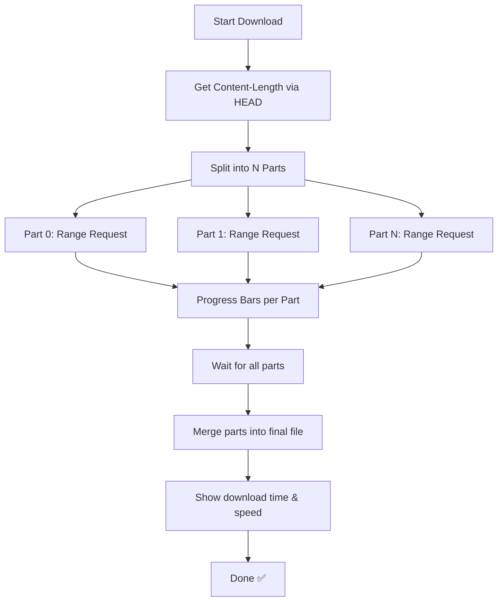

# 🧲 Parallel Downloader (Go)

A high-performance, CLI-based parallel file downloader written in Go.  
Inspired by tools like `wget`, `aria2`, and `curl --range`, this utility fetches large files fast using concurrent HTTP range requests with a clean UI and performance metrics.

---

## 🚀 Features

- 📦 HTTP range-based parallel download
- 📊 Real-time progress bars with per-part alignment
- 🧩 Automatic merging of parts
- 🕒 Download time + 🚀 average speed shown after completion

---

## 📥 Usage

```bash
./bin/downloader <url> <output_filename> <part_count>
```

- `<url>`: The file URL to download (must support HTTP `Range`)
- `<output_filename>`: The name of the output file (e.g. `movie.iso`)
- `<part_count>`: Number of concurrent parts to download (e.g. 4, 8)

---

## 💡 Example

```bash
./bin/downloader "https://example.com/ubuntu.iso" "ubuntu.iso" 4
```

This splits the download into 4 parts using goroutines and merges them into `ubuntu.iso`.

---

## 📁 Output

- Intermediate files:
  ```
  ubuntu.iso.part0
  ubuntu.iso.part1
  ...
  ```
- Final merged file:
  ```
  ubuntu.iso
  ```

---

## 🧠 Architecture



---

## 📦 Build

```bash
git clone https://github.com/yourusername/parallel-downloader.git
cd parallel-downloader
go mod tidy
go build -o bin/downloader main.go
```

---

## 📃 License

MIT License © [Your Name or Username]

---

## 🛠 Powered By

- [Go](https://golang.org/)
- [`mpb`](https://github.com/vbauerster/mpb) for progress bars
